# Architecture

## Network Diagram

```mermaid
graph TD
    Internet((Internet)) <--> Router[Home Router / Asus]
    Router <--> Switch[TP-Link 24-Port Switch]

    Switch <--> Desktop[Main Desktop<br/>RTX 4070 Super]
    Switch <--> NAS[NAS Node<br/>i3-12100 / 4x 12TB HDD]
    Switch <--> AppServer[App Server Node<br/>i5-13500 / RTX 2070 Super]
    Switch <--> PiHole[Raspberry Pi 5<br/>Pi-hole DNS]
    Switch <--> Designated_HA[Designated Home Assistant Machine]
    Switch <--> RPI[Raspberry Pi Shelf]

    subgraph Rack [In Rack]
        Switch

        subgraph NAS_Machine [NAS Machine]
            NAS
            Storage[ZFS Storage Pool]
            Shares[NFS & SMB Shares]
            Storage --> Shares
        end

        subgraph App_Server_Machine [App Server Machine]
            AppServer
            OS[Ubuntu Server]
            Docker[Docker Engine]
            OS --> Docker

            Tailscale[Tailscale VPN<br/>Mesh Network]

            subgraph Management [Management & Dashboard]
                Portainer[Portainer<br/>Container UI]
                Homepage[Homepage<br/>Dashboard]
                UptimeKuma[Uptime Kuma<br/>Status Monitoring]
                Watchtower[Watchtower<br/>Update Monitor]
            end

            subgraph Proxy_Auth [Reverse Proxy & Auth]
                NPM[Nginx Proxy Manager<br/>HTTPS Termination] --> Authelia[Authelia<br/>SSO / 2FA]
            end

            subgraph VPN_Pipeline [Secure Download Pipeline]
                Gluetun[Gluetun VPN] --> qBit[qBittorrent]
                Unpackerr[Unpackerr<br/>Auto-Extract]
            end

            subgraph Media_Automation [Media Automation]
                FlareSolverr[FlareSolverr<br/>CF Bypass] -.-> Prowlarr
                Prowlarr -.-> Radarr
                Prowlarr -.-> Sonarr
                Prowlarr -.-> Lidarr
                Recyclarr -.-> Radarr
                Recyclarr -.-> Sonarr
                Bazarr -.-> Sonarr
                Bazarr -.-> Radarr
            end

            subgraph Media_Services [Media Services]
                Jellyfin[Jellyfin<br/>GPU Passthrough]
                Seerr[Seerr<br/>Media Requests]
                Seerr --> Jellyfin
            end

            subgraph Monitoring_Stack [Monitoring]
                NodeExporter[Node Exporter] --> Prometheus
                Prometheus --> Grafana
            end

            subgraph Personal_Services [Personal Services]
                Vaultwarden[Vaultwarden<br/>Password Manager]
                Ntfy[Ntfy<br/>Push Notifications]
            end

            Duplicati[Duplicati<br/>Backup]

            Docker --> Tailscale
            Docker --> Management
            Docker --> Proxy_Auth
            Docker --> VPN_Pipeline
            Docker --> Media_Automation
            Docker --> Media_Services
            Docker --> Monitoring_Stack
            Docker --> Personal_Services
            Docker --> Duplicati
        end

        subgraph Main_Desktop [Main Desktop Machine]
            Desktop
        end

        subgraph Edge_Compute [Additional Compute Edges]
            PiHole
            Designated_HA
            RPI
        end

        Shares -.->|Mounted via fstab| OS
        Tailscale -.->|Remote Admin| Desktop
        UptimeKuma -.->|Alerts| Ntfy
        Watchtower -.->|Alerts| Ntfy
    end
    style Rack fill: #111111
```

---

## Services

### Management & Dashboard

| Service | Port | Description |
| :--- | :--- | :--- |
| **Portainer** | `9000` | Web UI for managing Docker containers, images, volumes, and logs. |
| **Tailscale** | `host` | Secure mesh VPN (WireGuard) for remote access from anywhere. |
| **Homepage** | `3001` | Customizable dashboard with live widgets for all services. |
| **Uptime Kuma** | `3002` | Service uptime monitoring and push alerting. |
| **Watchtower** | — | Daily scan for new container image versions. Monitor-only — never auto-updates. |

### Reverse Proxy & Auth

| Service | Port | Description |
| :--- | :--- | :--- |
| **Nginx Proxy Manager** | `80`, `443`, `81` | Reverse proxy with automatic HTTPS via Let's Encrypt. Admin UI on port `81`. |
| **Authelia** | `9091` | SSO and 2FA authentication portal, sits in front of services via NPM. |

### Secure Download Pipeline

| Service | Port | Description |
| :--- | :--- | :--- |
| **Gluetun** | — | VPN client container. All qBittorrent traffic is routed through it. |
| **qBittorrent** | `8080` | Torrent client. Network is locked to the Gluetun container. |
| **Unpackerr** | — | Sidecar that auto-extracts `.rar`/`.zip` archives after download completes. |
| **FlareSolverr** | `8191` | Cloudflare bypass proxy used by Prowlarr for protected indexers. |

### Media Automation

| Service | Port | Description |
| :--- | :--- | :--- |
| **Prowlarr** | `9696` | Indexer manager — syncs indexers to all *Arr apps. |
| **Radarr** | `7878` | Movie collection manager. |
| **Sonarr** | `8989` | TV series collection manager. |
| **Lidarr** | `8686` | Music collection manager. |
| **Recyclarr** | — | Syncs TRaSH Guides quality profiles and custom formats to Radarr and Sonarr on a schedule. |
| **Bazarr** | `6767` | Automatic subtitle management, integrated with Sonarr and Radarr. |

### Media Services

| Service | Port | Description |
| :--- | :--- | :--- |
| **Jellyfin** | `8096` | Media streaming server with GPU-accelerated transcoding. |
| **Seerr** | `5055` | Media request portal for Jellyfin users. |

### Monitoring

| Service | Port | Description |
| :--- | :--- | :--- |
| **Prometheus** | `9090` | Time-series metrics collection and storage. |
| **Grafana** | `3000` | Metrics visualization and dashboarding. |
| **Node Exporter** | `9100` | Exposes host-level hardware and OS metrics to Prometheus. |

### Personal Services

| Service | Port | Description |
| :--- | :--- | :--- |
| **Vaultwarden** | `8888` | Self-hosted Bitwarden-compatible password manager. |
| **Ntfy** | `2586` | Self-hosted push notification server. Receives alerts from Uptime Kuma and Watchtower. |

### Backup

| Service | Port | Description |
| :--- | :--- | :--- |
| **Duplicati** | `8200` | Automated encrypted backup of all container config directories. |

### Network Infrastructure (not Docker)

| Service | Port | Description |
| :--- | :--- | :--- |
| **Pi-hole** | `80` | Network-wide DNS server and ad blocker running on Raspberry Pi 5. Handles local DNS records for all lab hostnames. |

---

## Design Decisions

### VPN Kill-Switch
qBittorrent is locked to the network namespace of the `gluetun` container and will not start until Gluetun's VPN tunnel is confirmed healthy via a `depends_on: condition: service_healthy` check against Gluetun's internal HTTP control server. If the VPN drops, qBittorrent loses all internet connectivity — no IP leaks possible.

### Hardware Transcoding
Jellyfin is configured with Nvidia NVENC GPU passthrough (RTX 2070 Super). The NVIDIA Container Toolkit exposes the GPU to the container, enabling hardware-accelerated encoding and decoding. This offloads transcoding from the CPU entirely and supports multiple simultaneous 4K streams.

### HTTPS & Authentication
Nginx Proxy Manager acts as the single entry point for all web-facing services, terminating TLS with Let's Encrypt certificates. Authelia sits behind NPM as a forward auth middleware, adding SSO and 2FA to any service that lacks built-in authentication.

### Automated Media Pipeline
The *Arr stack (Radarr, Sonarr, Lidarr) handles search, grab, and import automatically via Prowlarr-managed indexers. Unpackerr monitors the download directory and extracts compressed archives so the *Arr apps can import without manual intervention. Recyclarr syncs community TRaSH Guides quality profiles on a schedule so settings never drift.

### Monitoring
Node Exporter runs on the host network and exposes hardware and OS-level metrics (CPU, RAM, disk, network). Prometheus scrapes these on a 15-second interval with 30-day retention. Grafana connects to Prometheus and provides dashboards and alerting.

### Storage
The NAS runs TrueNAS SCALE with a 4-drive RAID-Z1 ZFS pool (~36TB usable). NFS shares are permanently mounted on the App Server via `/etc/fstab`, making the storage transparent to all Docker containers via volume mounts.

### DNS & Ad Blocking
Pi-hole runs on a dedicated Raspberry Pi 5 and acts as the network-wide DNS server. The Asus router's DHCP hands out the Pi's IP as the DNS server for all clients, so every device on the network gets ad blocking and local hostname resolution without any per-device configuration. Local DNS records (`truenas.home`, `appserver.home`, per-service hostnames) are managed in Pi-hole's web UI and point Docker services to the App Server IP, with NPM routing by hostname from there.

### Alerting & Update Awareness
Ntfy is the central notification hub. Uptime Kuma monitors all service HTTP health endpoints and routes down-alerts to Ntfy, which delivers them to the ntfy mobile app. Watchtower scans for new container image versions daily in monitor-only mode and can optionally send its findings to Ntfy as well. Updates are applied manually — pull the new image and recreate only the affected container.
