# Architecture

## Network Diagram

```mermaid
graph TD
    Internet((Internet)) <--> Router[Home Router]
    Router <--> Switch[TP-Link 24-Port Switch]

    Switch <--> Desktop[Main Desktop<br/>RTX 4070 Super]
    Switch <--> NAS[NAS Node<br/>i3-12100 / 4x 12TB HDD]
    Switch <--> AppServer[App Server Node<br/>i5-13500 / RTX 2070 Super]
    Switch <--> Designated_HA[Designated Home Assistant Machine]
    Switch <--> RPI1[Raspberry Pi 1]
    Switch <--> RPI2[Raspberry Pi 2]

    subgraph Rack [In Rack]
        Switch

        subgraph NAS_Machine [NAS Machine]
            NAS
            Storage[ZFS Storage Pool]
            Shares[NFS & SMB Shares]
            Storage --> Shares
        end

        subgraph App_Server_Machine [App Server Machine]
            AppServer
            OS[Ubuntu Server]
            Docker[Docker Engine]
            OS --> Docker

            Tailscale[Tailscale VPN<br/>Mesh Network]

            subgraph Proxy_Auth [Reverse Proxy & Auth]
                NPM[Nginx Proxy Manager<br/>HTTPS Termination] --> Authelia[Authelia<br/>SSO / 2FA]
            end

            subgraph VPN_Pipeline [Secure Download Pipeline]
                Gluetun[Gluetun VPN] --> qBit[qBittorrent]
                Unpackerr[Unpackerr<br/>Auto-Extract]
            end

            subgraph Media_Automation [Media Automation]
                Prowlarr -.-> Radarr
                Prowlarr -.-> Sonarr
                Prowlarr -.-> Lidarr
                Recyclarr -.-> Radarr
                Recyclarr -.-> Sonarr
            end

            subgraph Media_Services [Media Services]
                Jellyfin[Jellyfin<br/>GPU Passthrough]
                Seerr[Seerr<br/>Media Requests]
                Seerr --> Jellyfin
            end

            subgraph Monitoring_Stack [Monitoring]
                NodeExporter[Node Exporter] --> Prometheus
                Prometheus --> Grafana
            end

            Duplicati[Duplicati<br/>Backup]

            Docker --> Tailscale
            Docker --> Proxy_Auth
            Docker --> VPN_Pipeline
            Docker --> Media_Automation
            Docker --> Media_Services
            Docker --> Monitoring_Stack
            Docker --> Duplicati
        end

        subgraph Main_Desktop [Main Desktop Machine]
            Desktop
        end

        subgraph Edge_Compute [Additional Compute Edges]
            Designated_HA
            RPI1
            RPI2
        end

        Shares -.->|Mounted via fstab| OS
        Tailscale -.->|Remote Admin| Desktop
    end
    style Rack fill: #111111
```

---

## Services

| Service | Port | Description |
| :--- | :--- | :--- |
| **Portainer** | `9000` | Lightweight management UI for Docker environments. |
| **Tailscale** | `host` | Secure mesh network (WireGuard VPN) for remote access. |
| **Nginx Proxy Manager** | `80`, `443`, `81` | Reverse proxy with automatic HTTPS via Let's Encrypt. Admin UI on port `81`. |
| **Authelia** | `9091` | SSO and 2FA authentication portal, sits in front of services via NPM. |
| **Gluetun** | — | VPN client container. All qBittorrent traffic is routed through it. |
| **qBittorrent** | `8080` | Torrent client. Network is locked to the Gluetun container. |
| **Unpackerr** | — | Sidecar that auto-extracts `.rar`/`.zip` archives after download completes. |
| **Prowlarr** | `9696` | Indexer manager for the *Arr stack. |
| **Radarr** | `7878` | Movie collection manager. |
| **Sonarr** | `8989` | TV series collection manager. |
| **Lidarr** | `8686` | Music collection manager. |
| **Recyclarr** | — | Automatically syncs quality profiles and custom formats to Radarr and Sonarr. |
| **Jellyfin** | `8096` | Media streaming server with GPU-accelerated transcoding. |
| **Seerr** | `5055` | Media request portal for Jellyfin users. |
| **Prometheus** | `9090` | Time-series metrics collection and storage. |
| **Grafana** | `3000` | Metrics visualization and dashboarding. |
| **Node Exporter** | `9100` | Exposes host-level hardware and OS metrics to Prometheus. |
| **Duplicati** | `8200` | Automated encrypted backup of all container config directories. |

---

## Design Decisions

### VPN Kill-Switch
qBittorrent is locked to the network namespace of the `gluetun` container and will not start until Gluetun's VPN tunnel is confirmed healthy via a `depends_on: condition: service_healthy` check against Gluetun's internal HTTP control server. If the VPN drops, qBittorrent loses all internet connectivity — no IP leaks possible.

### Hardware Transcoding
Jellyfin is configured with Nvidia NVENC GPU passthrough (RTX 2070 Super). The NVIDIA Container Toolkit exposes the GPU to the container, enabling hardware-accelerated encoding and decoding. This offloads transcoding from the CPU entirely and supports multiple simultaneous 4K streams.

### HTTPS & Authentication
Nginx Proxy Manager acts as the single entry point for all web-facing services, terminating TLS with Let's Encrypt certificates. Authelia sits behind NPM as a forward auth middleware, adding SSO and 2FA to any service that lacks built-in authentication.

### Automated Media Pipeline
The *Arr stack (Radarr, Sonarr, Lidarr) handles search, grab, and import automatically via Prowlarr-managed indexers. Unpackerr monitors the download directory and extracts compressed archives so the *Arr apps can import without manual intervention. Recyclarr syncs community TRaSH Guides quality profiles on a schedule so settings never drift.

### Monitoring
Node Exporter runs on the host network and exposes hardware and OS-level metrics (CPU, RAM, disk, network). Prometheus scrapes these on a 15-second interval with 30-day retention. Grafana connects to Prometheus and provides dashboards and alerting.

### Storage
The NAS runs TrueNAS SCALE with a 4-drive RAID-Z1 ZFS pool (~36TB usable). NFS shares are permanently mounted on the App Server via `/etc/fstab`, making the storage transparent to all Docker containers via volume mounts.
