# Home Lab Media Server Setup

This repository contains the `docker-compose.yml` and configuration instructions for deploying my containerized home media server.

The setup is designed around two primary machines: a TrueNAS SCALE server for storage (NAS) and a Ubuntu server for running applications leveraging GPU passthrough for hardware-accelerated video transcoding.

## Architecture Diagram

```mermaid
graph TD
    Internet((Internet)) <--> Router[Home Router]
    Router <--> Switch[TP-Link 24-Port Switch]

    Switch <--> Desktop[Main Desktop<br/>RTX 4070 Super]
    Switch <--> NAS[NAS Node<br/>i3-12100 / 4x 12TB HDD]
    Switch <--> AppServer[App Server Node<br/>i5-13500 / RTX 2070 Super]
    Switch <--> Designated_HA[Designated Home Assistant Machine]
    Switch <--> RPI1[Raspberry Pi 1]
    Switch <--> RPI2[Raspberry Pi 2]

    subgraph Rack [In Rack]
        Switch

        subgraph NAS_Machine [NAS Machine]
            NAS
            Storage[ZFS Storage Pool]
            Shares[NFS & SMB Shares]
            Storage --> Shares
        end

        subgraph App_Server_Machine [App Server Machine]
            AppServer
            OS[Ubuntu Server]
            Docker[Docker Engine]
            OS --> Docker

            Tailscale[Tailscale VPN<br/>Mesh Network]

            subgraph Proxy_Auth [Reverse Proxy & Auth]
                NPM[Nginx Proxy Manager<br/>HTTPS Termination] --> Authelia[Authelia<br/>SSO / 2FA]
            end

            subgraph VPN_Pipeline [Secure Download Pipeline]
                Gluetun[Gluetun VPN] --> qBit[qBittorrent]
                Unpackerr[Unpackerr<br/>Auto-Extract]
            end

            subgraph Media_Automation [Media Automation]
                Prowlarr -.-> Radarr
                Prowlarr -.-> Sonarr
                Prowlarr -.-> Lidarr
                Recyclarr -.-> Radarr
                Recyclarr -.-> Sonarr
            end

            subgraph Media_Services [Media Services]
                Jellyfin[Jellyfin<br/>GPU Passthrough]
                Jellyseerr[Jellyseerr<br/>Media Requests]
                Jellyseerr --> Jellyfin
            end

            subgraph Monitoring_Stack [Monitoring]
                NodeExporter[Node Exporter] --> Prometheus
                Prometheus --> Grafana
            end

            Duplicati[Duplicati<br/>Backup]

            Docker --> Tailscale
            Docker --> Proxy_Auth
            Docker --> VPN_Pipeline
            Docker --> Media_Automation
            Docker --> Media_Services
            Docker --> Monitoring_Stack
            Docker --> Duplicati
        end

        subgraph Main_Desktop [Main Desktop Machine]
            Desktop
        end

        subgraph Edge_Compute [Additional Compute Edges]
            Designated_HA
            RPI1
            RPI2
        end

        Shares -.->|Mounted via fstab| OS
        Tailscale -.->|Remote Admin| Desktop
    end
    style Rack fill: #111111
```



## Services

This stack includes the following services, orchestrated by Docker Compose:

| Service | Port | Description |
| :--- | :--- | :--- |
| **Portainer** | `9000` | Lightweight management UI for Docker environments. |
| **Tailscale** | `host` | Secure mesh network (WireGuard VPN) for remote access. |
| **Nginx Proxy Manager** | `80`, `443`, `81` | Reverse proxy with automatic HTTPS via Let's Encrypt. Admin UI on port `81`. |
| **Authelia** | `9091` | SSO and 2FA authentication portal, sits in front of services via NPM. |
| **Gluetun** | — | VPN client container. All of qBittorrent's traffic is routed through it. |
| **qBittorrent** | `8080` | Torrent client. Its network is locked to the Gluetun container. |
| **Unpackerr** | — | Sidecar that auto-extracts `.rar`/`.zip` archives after download completes. |
| **Prowlarr** | `9696` | Indexer manager for the *Arr stack. |
| **Radarr** | `7878` | Movie collection manager. |
| **Sonarr** | `8989` | TV series collection manager. |
| **Lidarr** | `8686` | Music collection manager. |
| **Recyclarr** | — | Automatically syncs quality profiles and custom formats to Radarr and Sonarr. |
| **Jellyfin** | `8096` | Media streaming server with GPU-accelerated transcoding. |
| **Jellyseerr** | `5055` | Media request portal for Jellyfin users. |
| **Prometheus** | `9090` | Time-series metrics collection and storage. |
| **Grafana** | `3000` | Metrics visualization and dashboarding. |
| **Node Exporter** | `9100` | Exposes host-level hardware and OS metrics to Prometheus. |
| **Duplicati** | `8200` | Automated encrypted backup of all container config directories. |

## Key Features

- **Secure Download Pipeline:** qBittorrent is configured with a "network kill-switch." It is forced to use the network of the `gluetun` container. Critically, qBittorrent will not start until the VPN tunnel is confirmed healthy via a `depends_on` condition, preventing any IP leaks at startup.
- **Hardware Transcoding:** The Jellyfin service is configured to use an Nvidia GPU (`RTX 2070 Super`) for hardware-accelerated video transcoding, ensuring smooth playback on client devices without heavily loading the CPU.
- **HTTPS & Authentication:** Nginx Proxy Manager provides a single HTTPS entry point for all services with automatic Let's Encrypt certificate management. Authelia adds SSO and 2FA in front of any service that lacks built-in authentication.
- **Automated Media Pipeline:** The full *Arr stack (Radarr, Sonarr, Lidarr) is managed through Prowlarr. Unpackerr completes the pipeline by automatically extracting downloaded archives so the *Arr apps can import them without manual intervention.
- **Quality Profile Sync:** Recyclarr keeps Radarr and Sonarr quality profiles aligned with community-maintained TRaSH Guides standards automatically.
- **Media Request Portal:** Jellyseerr allows household users to browse and request movies/shows, which are automatically routed to Radarr or Sonarr.
- **Full-Stack Monitoring:** Node Exporter collects host hardware and OS metrics. Prometheus scrapes and stores them. Grafana visualizes them in dashboards with configurable alerting.
- **Automated Backups:** Duplicati automatically backs up all container config directories (databases, settings, API keys) on a schedule to the NAS or an offsite destination.
- **Remote Access:** Tailscale provides secure access to the App Server and its services from anywhere.

## Setup Instructions

This guide assumes you have assembled the physical hardware and connected it as shown in the diagram.

### Phase 1: NAS Setup (TrueNAS SCALE)

1.  **Install OS:** Install TrueNAS SCALE on your NAS node.
2.  **Create Storage Pool:** Create a ZFS pool with your desired redundancy (e.g., RAID-Z1).
3.  **Create Datasets:** Create datasets for your media and downloads (e.g., `/mnt/pool/media`, `/mnt/pool/downloads`).
4.  **Enable Shares:** Turn on the NFS service. This will be used by the App Server to mount the storage. Optionally, enable SMB for easy access from Windows machines.

### Phase 2: App Server Setup (Ubuntu Server)

1.  **Install OS:** Install Ubuntu Server LTS. Make sure to install the OpenSSH server for headless management.
2.  **Install GPU Drivers:** Install the proprietary Nvidia drivers for your GPU.
3.  **Install Docker:** Install Docker Engine and the NVIDIA Container Toolkit, which allows Docker containers to access the GPU.
4.  **Install Tailscale:** Run `curl -fsSL https://tailscale.com/install.sh | sh` to install Tailscale on the host.
5.  **Mount NAS Storage:**
    -   Edit the `/etc/fstab` file on the App Server to permanently mount the NFS shares from your NAS.
    -   Example `fstab` entry:
        ```
        <NAS_IP>:/mnt/pool/media    /mnt/nas/media    nfs auto,nofail,noatime,nolock,intr,tcp,actimeo=1800 0 0
        <NAS_IP>:/mnt/pool/downloads /mnt/nas/downloads nfs auto,nofail,noatime,nolock,intr,tcp,actimeo=1800 0 0
        ```
    -   Run `sudo mount -a` to apply the mounts and `df -h` to verify they are present.

### Phase 3: Docker Stack Deployment

1.  **Create `.env` file:** In the same directory as the `docker-compose.yml`, create a `.env` file:
    ```env
    PUID=1000
    PGID=1000
    TIMEZONE=America/New_York

    # VPN Credentials
    VPN_USER=your_vpn_username
    VPN_PASS=your_vpn_password

    # *Arr API Keys (retrieve from each app's Settings > General after first launch)
    SONARR_API_KEY=your_sonarr_api_key
    RADARR_API_KEY=your_radarr_api_key
    LIDARR_API_KEY=your_lidarr_api_key

    # Grafana credentials
    GRAFANA_USER=admin
    GRAFANA_PASSWORD=your_secure_grafana_password
    ```

2.  **Update Volume Paths:** In the `docker-compose.yml` file, search for all `# Update this path` comments and replace the placeholder paths with your actual NAS mount points:
    -   `/path/to/your/nas/downloads` → `/mnt/nas/downloads`
    -   `/path/to/your/nas/data` → `/mnt/nas/media`

3.  **Create the Prometheus config file** at `./config/prometheus/prometheus.yml`:
    ```yaml
    global:
      scrape_interval: 15s
      evaluation_interval: 15s

    scrape_configs:
      - job_name: 'prometheus'
        static_configs:
          - targets: ['localhost:9090']

      - job_name: 'node-exporter'
        static_configs:
          - targets: ['localhost:9100']
    ```

4.  **Deploy the Stack:**
    ```bash
    docker compose up -d
    ```

### Phase 4: Reverse Proxy & Auth Setup (Nginx Proxy Manager + Authelia)

1.  **Initial NPM Login:** Open `http://<server-ip>:81`. Default credentials are `admin@example.com` / `changeme`. Change them immediately.
2.  **Add Proxy Hosts:** For each service you want to expose (e.g., Jellyfin, Jellyseerr, Grafana), create a Proxy Host in NPM pointing to `http://<container-name>:<port>` and enable "Force SSL" with a Let's Encrypt certificate.
3.  **Configure Authelia:**
    -   Create `./config/authelia/configuration.yml` and `./config/authelia/users_database.yml` following the [Authelia documentation](https://www.authelia.com/configuration/prologue/introduction/).
    -   In NPM, for each proxy host you want protected, add the following to the "Advanced" tab under Custom Nginx Configuration:
        ```nginx
        location /authelia {
            internal;
            set $upstream_authelia http://authelia:9091/api/verify;
            proxy_pass_request_body off;
            proxy_pass $upstream_authelia;
            proxy_set_header Content-Length "";
            proxy_set_header X-Original-URL $scheme://$http_host$request_uri;
        }
        ```
    -   Then add `auth_request /authelia;` to the relevant location blocks.

### Phase 5: Monitoring Setup (Prometheus + Grafana)

1.  **Verify Metrics Collection:** Open Prometheus at `http://<server-ip>:9090` and navigate to **Status > Targets**. Confirm both `node-exporter` and `prometheus` are showing as `UP`.
2.  **Set up Grafana:**
    -   Open Grafana at `http://<server-ip>:3000` and log in with your `GRAFANA_USER` and `GRAFANA_PASSWORD`.
    -   Add a Prometheus data source pointing to `http://prometheus:9090`.
3.  **Import Dashboards:** In Grafana, go to **Dashboards > Import** and import the following community dashboards by ID:
    -   **Node Exporter Full** — ID `1860` (comprehensive host metrics: CPU, RAM, disk, network)

### Phase 6: Recyclarr Setup

Recyclarr automatically applies community-standard quality profiles from the TRaSH Guides to your Radarr and Sonarr instances.

1.  **Run first-time init** to generate a starter config:
    ```bash
    docker exec -it recyclarr recyclarr config create
    ```
2.  **Edit the generated config** at `./config/recyclarr/recyclarr.yml`. At minimum, fill in your API keys:
    ```yaml
    sonarr:
      sonarr-main:
        base_url: http://sonarr:8989
        api_key: your_sonarr_api_key

    radarr:
      radarr-main:
        base_url: http://radarr:7878
        api_key: your_radarr_api_key
    ```
3.  **Sync manually** to test: `docker exec -it recyclarr recyclarr sync`
4.  Recyclarr runs on a schedule automatically based on its internal cron. Logs can be viewed with `docker logs recyclarr`.

### Phase 7: Backup Setup (Duplicati)

1.  Open Duplicati at `http://<server-ip>:8200`.
2.  Create a new backup job:
    -   **Source:** `/source` (mapped to `./config` — all container configs)
    -   **Destination:** Your NAS backup dataset or a cloud storage provider (B2, S3, etc.)
    -   **Schedule:** Recommended: nightly at 2 AM
    -   **Encryption:** Enable with a strong passphrase and store it safely
3.  Run a manual backup and verify the restore process works before relying on it.

### Phase 8: Post-Deployment Wiring & Validation

#### Wiring the *Arr Stack
After all containers are running, connect the services together:

1.  **Prowlarr → Radarr/Sonarr/Lidarr:** In Prowlarr, go to **Settings > Apps** and add each *Arr app using its container name as the hostname (e.g., `http://radarr:7878`). Prowlarr will sync indexers automatically.
2.  **qBittorrent → Radarr/Sonarr/Lidarr:** In each *Arr app, go to **Settings > Download Clients** and add qBittorrent pointing to `http://gluetun:8080` (it's accessed via Gluetun's port mapping).
3.  **Jellyseerr → Jellyfin:** Open Jellyseerr at `http://<server-ip>:5055`. Follow the setup wizard and sign in with your Jellyfin admin account. Then connect Radarr and Sonarr in **Settings > Services**.

#### Validation Checks

1.  **VPN Kill-Switch:** Confirm qBittorrent cannot start if Gluetun is unhealthy by running `docker stop gluetun` — qBittorrent should lose connectivity. Confirm the active IP is your VPN's: `docker exec -it gluetun wget -qO- https://ifconfig.me`
2.  **Hardware Transcoding:** In Jellyfin admin, go to **Dashboard > Playback** and select "Nvidia NVENC". Play a 4K video and run `nvidia-smi` on the host — a `jellyfin` process should appear using the GPU encoder.
3.  **HTTPS:** Verify all externally-exposed services load over HTTPS with a valid certificate.
4.  **Monitoring:** Confirm Grafana dashboards show live data from Node Exporter.
5.  **Backup:** Trigger a manual Duplicati backup and verify it completes without errors.

## Changelog

### v2.0 — Major Enhancements
- **[Fix]** Added `depends_on` with `condition: service_healthy` on qBittorrent → Gluetun. qBittorrent will no longer start until the VPN tunnel is confirmed active, closing a potential IP leak window at container startup.
- **[Fix]** Removed deprecated `version: "3.8"` top-level key from `docker-compose.yml`.
- **[Fix]** Added container `healthcheck` definitions for all services that expose an HTTP endpoint.
- **[New]** Added **Nginx Proxy Manager** — single HTTPS entry point for all services with automatic Let's Encrypt certificate management.
- **[New]** Added **Authelia** — SSO and 2FA authentication portal; protects services that lack built-in auth.
- **[New]** Added **Unpackerr** — automatically extracts `.rar`/`.zip` archives after download completes, allowing the *Arr apps to import without manual intervention.
- **[New]** Added **Recyclarr** — automatically syncs community TRaSH Guides quality profiles to Radarr and Sonarr.
- **[New]** Added **Jellyseerr** — media request portal for Jellyfin users; requests route automatically to Radarr/Sonarr.
- **[New]** Added **Prometheus** — time-series metrics collection with 30-day retention.
- **[New]** Added **Grafana** — metrics dashboards; pre-wired to Prometheus data source.
- **[New]** Added **Node Exporter** — exposes host CPU, RAM, disk, and network metrics to Prometheus.
- **[New]** Added **Duplicati** — encrypted, scheduled backup of all container config directories.
- **[New]** Added named Docker volumes for Prometheus and Grafana data persistence.
- **[New]** Added post-deployment wiring guide for connecting the *Arr stack and Jellyseerr.
- **[New]** Updated architecture diagram to include all new services.
- **[New]** Added new `.env` variables: `SONARR_API_KEY`, `RADARR_API_KEY`, `LIDARR_API_KEY`, `GRAFANA_USER`, `GRAFANA_PASSWORD`.

### v1.0 — Initial Release
- Docker Compose stack with Portainer, Tailscale, Gluetun, qBittorrent, Prowlarr, Radarr, Sonarr, Lidarr, and Jellyfin.
- NAS integration via NFS mounts.
- Nvidia GPU passthrough for Jellyfin hardware transcoding.
