# Home Lab Media Server Setup

This repository contains the `docker-compose.yml` and configuration instructions for deploying my containerized home media server.

The setup is designed around two primary machines: a TrueNAS SCALE server for storage (NAS) and a Ubuntu server for running applications leveraging GPU passthrough for hardware-accelerated video transcoding.

## Architecture Diagram

```mermaid
graph TD
    Internet((Internet)) <--> Router[Home Router]
    Router <--> Switch[TP-Link 24-Port Switch]

    Switch <--> Desktop[Main Desktop\nRTX 4070 Super]
    Switch <--> NAS[NAS Node\ni3-12100 / 4x 12TB HDD]
    Switch <--> AppServer[App Server Node\ni5-13500 / RTX 2070 Super]
    Switch <--> Designated_HA[Designated Home Assistant Machine]
    Switch <--> RPI1[Raspberry Pi 1]
    Switch <--> RPI2[Raspberry Pi 2]

    subgraph Rack [In Rack]
        Switch

        subgraph NAS Machine
            NAS
            Storage[ZFS Storage Pool]
            Shares[NFS & SMB Shares]
            Storage --> Shares

        end

        subgraph App Server Machine
            AppServer
            OS[Ubuntu Server]
            Docker[Docker Engine]
            OS --> Docker

            Tailscale[Tailscale VPN\nMesh Network]
            Jellyfin[Jellyfin\nGPU Passthrough]

            subgraph VPN_Pipeline
                Gluetun[Gluetun VPN] --> qBit[qBittorrent]
            end

            subgraph Media_Automation
                Prowlarr -.-> Radarr
                Prowlarr -.-> Sonarr
                Prowlarr -.-> Lidarr
            end

            Docker --> Tailscale
            Docker --> Jellyfin
            Docker --> VPN_Pipeline
            Docker --> Media_Automation
        end

        subgraph Main Desktop Machine
            Desktop
        end

        subgraph Additional Compute Edges
            Designated_HA
            RPI1
            RPI2
        end

        Shares -.->|Mounted via fstab| OS
        Tailscale -.->|Remote Admin| Desktop
    end
    style Rack fill: #111111
```



## Services

This stack includes the following services, orchestrated by Docker Compose:

| Service | Port | Description |
| :--- | :--- | :--- |
| **Portainer** | `9000` | Lightweight management UI for Docker environments. |
| **Tailscale** | `host` | Secure mesh network (wireguard VPN) for remote access. |
| **Gluetun** | `8080` | VPN client container. All of qBittorrent's traffic is routed through it. |
| **qBittorrent**| `n/a` | Torrent client. Its network is locked to the Gluetun container. |
| **Prowlarr** | `9696` | Indexer manager for the *Arr stack. |
| **Radarr** | `7878` | Movie collection manager. |
| **Sonarr** | `8989` | TV series collection manager. |
| **Lidarr** | `8686` | Music collection manager. |
| **Jellyfin** | `8096` | Media streaming server with GPU-accelerated transcoding. |

## Key Features

- **Secure Download Pipeline:** qBittorrent is configured with a "network kill-switch." It is forced to use the network of the `gluetun` container. If the VPN connection drops, qBittorrent loses all internet connectivity, preventing any IP leaks.
- **Hardware Transcoding:** The Jellyfin service is configured to use an Nvidia GPU (`RTX 2070 Super` I had spare) for hardware-accelerated video transcoding, ensuring smooth playback on client devices without heavily loading the CPU.
- **Centralized Management:** The entire *Arr stack (Radarr, Sonarr, Lidarr) is managed through Prowlarr, simplifying indexer configuration.
- **Remote Access:** Tailscale provides secure access to the App Server and its services from anywhere.

## Setup Instructions

This guide assumes you have assembled the physical hardware and connected it as shown in the diagram.

### Phase 1: NAS Setup (TrueNAS SCALE)

1.  **Install OS:** Install TrueNAS SCALE on your NAS node.
2.  **Create Storage Pool:** Create a ZFS pool with your desired redundancy (e.g., RAID-Z1).
3.  **Create Datasets:** Create datasets for your media and downloads (e.g., `/mnt/pool/media`, `/mnt/pool/downloads`).
4.  **Enable Shares:** Turn on the NFS service. This will be used by the App Server to mount the storage. Optionally, enable SMB for easy access from Windows machines.

### Phase 2: App Server Setup (Ubuntu Server)

1.  **Install OS:** Install Ubuntu Server LTS. Make sure to install the OpenSSH server for headless management.
2.  **Install GPU Drivers:** Install the proprietary Nvidia drivers for your GPU.
3.  **Install Docker:** Install Docker Engine and the NVIDIA Container Toolkit, which allows Docker containers to access the GPU.
4.  **Install Tailscale:** Run `curl -fsSL https://tailscale.com/install.sh | sh` to install Tailscale on the host.
5.  **Mount NAS Storage:**
    -   Edit the `/etc/fstab` file on the App Server to permanently mount the NFS shares from your NAS.
    -   Example `fstab` entry:
        ```
        <NAS_IP>:/mnt/pool/media    /mnt/nas/media    nfs auto,nofail,noatime,nolock,intr,tcp,actimeo=1800 0 0
        <NAS_IP>:/mnt/pool/downloads /mnt/nas/downloads nfs auto,nofail,noatime,nolock,intr,tcp,actimeo=1800 0 0
        ```
    -   Run `sudo mount -a` to apply the mounts and `df -h` to verify they are present.

### Phase 3: Docker Stack Deployment

1.  **Create `.env` file:** In the same directory where you place the `docker-compose.yml` file, create a file named `.env` with the following content:
    ```env
    PUID=1000
    PGID=1000
    TIMEZONE=America/New_York # Set to your timezone
    VPN_USER=your_vpn_username
    VPN_PASS=your_vpn_password
    ```

2.  **Update Volume Paths:** In the `docker-compose.yml` file, update all volume paths that point to your NAS to match the mount points you created in `fstab`. For example:
    -   `- /path/to/your/nas/downloads:/downloads` becomes `- /mnt/nas/downloads:/downloads`
    -   `- /path/to/your/nas/data:/data` becomes `- /mnt/nas/media:/data`

3.  **Deploy the Stack:** Run the following command to pull the images and start all services:
    ```bash
    docker compose up -d
    ```

### Phase 4: Post-Deployment Validation

1.  **VPN Killswitch:** Access the qBittorrent web UI (forwarded through Gluetun to port `8080`). To confirm the VPN is active, SSH into your App Server and run `docker exec -it qbittorrent curl ifconfig.me`. The IP address returned **must** be your VPN provider's IP, not your home IP.
2.  **Hardware Transcoding:** Open the Jellyfin web UI. In the admin dashboard under Playback, select "Nvidia NVENC" as the hardware acceleration option. Play a 4K video file and run `nvidia-smi` on the App Server. You should see a `jellyfin` process utilizing the GPU's memory and video encoder.
