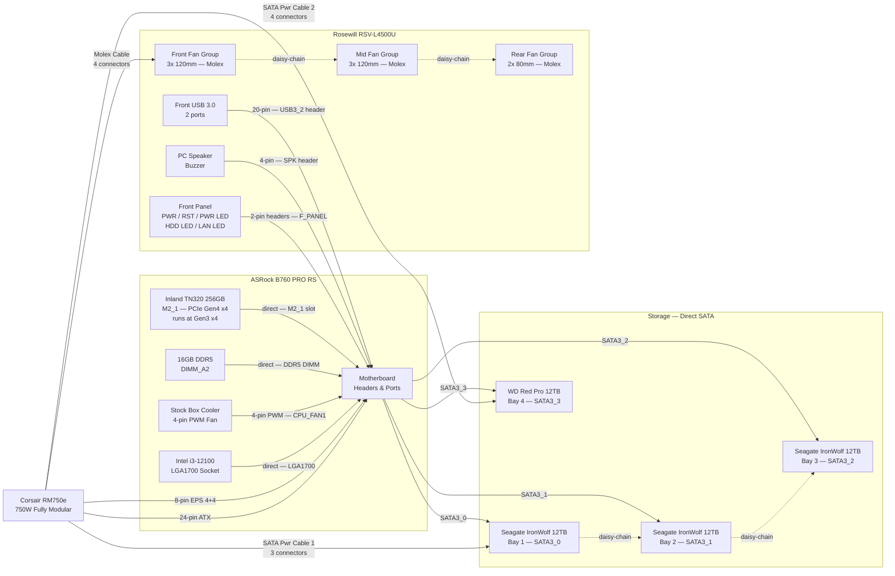
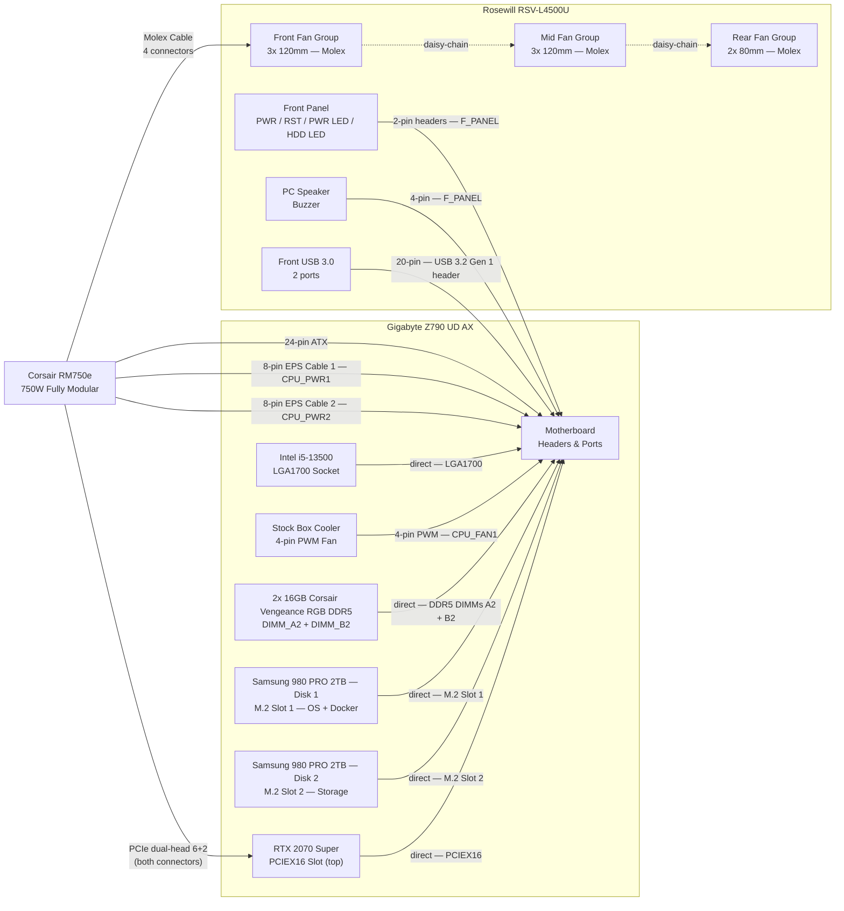
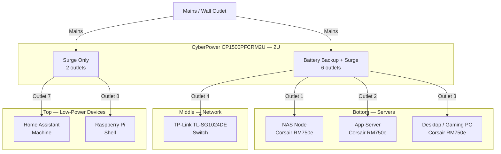
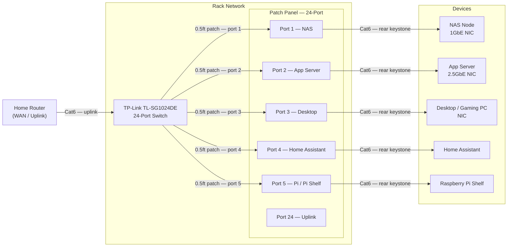
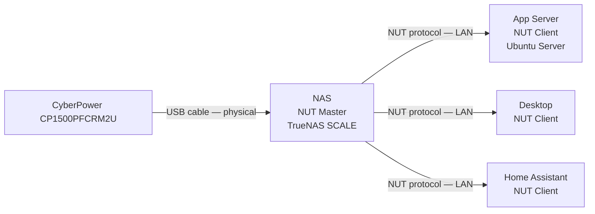

# Wiring Diagrams

Internal cabling reference for each node. Covers power, data, and front-panel connections. Solid arrows are direct cable runs; dashed arrows are daisy-chained connectors on the same cable.

---

## NAS Node

**Motherboard:** ASRock B760 PRO RS
**PSU:** Corsair RM750e 750W (fully modular)
**Chassis:** Rosewill RSV-L4500U (non-hot-swap — direct SATA to each drive)

### Diagram

---

### Connection Reference

#### Power

| Cable | From | To | Connectors Used |
| :--- | :--- | :--- | :--- |
| 24-pin ATX | PSU | MB — 24-pin ATX | 1 of 1 |
| 8-pin EPS (4+4) | PSU | MB — CPU_PWR1 | 1 of 2 included |
| SATA Power Cable 1 (3-conn) | PSU | HDD1 → HDD2 → HDD3 (daisy-chain) | 3 of 3 |
| SATA Power Cable 2 (4-conn) | PSU | HDD4 | 1 of 4 |
| Molex Cable (4-conn) | PSU | Front fans → Mid fans → Rear fans (daisy-chain) | 3 of 4 |

> **Unused PSU cables (leave unplugged):** 2nd EPS 8-pin, 12VHPWR (16-pin), both PCIe 6+2 cables.

#### SATA Data

| Cable | Motherboard Port | Drive |
| :--- | :--- | :--- |
| SATA data #1 | SATA3_0 | Seagate IronWolf 12TB — Bay 1 |
| SATA data #2 | SATA3_1 | Seagate IronWolf 12TB — Bay 2 |
| SATA data #3 | SATA3_2 | Seagate IronWolf 12TB — Bay 3 |
| SATA data #4 | SATA3_3 | WD Red Pro 12TB — Bay 4 |

> No SATA ports are disabled by the M.2 boot drive. All 4 SATA3 ports remain fully available regardless of M2_1 occupancy on the B760 PRO RS.

#### Direct / No-Cable Connections

| Component | Connection |
| :--- | :--- |
| Intel i3-12100 | Seats directly into LGA1700 socket |
| Stock box cooler fan | 4-pin PWM cable → CPU_FAN1 header |
| 16GB DDR5 | Seats directly into **DIMM_A2** (second slot from CPU — correct slot for single-stick) |
| Inland TN320 NVMe | Seats directly into **M2_1** (top slot, CPU-direct, includes heatsink) |

#### Front Panel

| Signal | Header on MB | Notes |
| :--- | :--- | :--- |
| Power button | F_PANEL — PWRBTN | 2-pin |
| Reset button | F_PANEL — RESET | 2-pin |
| Power LED | F_PANEL — PWRLED | 2-pin, polarity matters |
| HDD activity LED | F_PANEL — HDLED | 2-pin, polarity matters |
| LAN activity LED | — | Not supported by most consumer motherboard front-panel headers; leave disconnected |
| PC Speaker / Buzzer | SPK header | 4-pin |
| Front USB 3.0 (2 ports) | USB3_2 header | 20-pin connector |

---

### Notes

- **Fan power:** All 8 case fans use 4-pin Molex connectors and are grouped by location (front / mid / rear). Each group daisy-chains its fans together sharing one Molex connector off the cable. Only 3 of the 4 available Molex connectors on the RM750e's Molex cable are needed — no splitter required.
- **Single EPS cable:** The i3-12100 requires only one 8-pin EPS connection (CPU_PWR1). The second EPS cable included with the RM750e is not needed.
- **SATA power headroom:** SATA Power Cable 2 has 3 spare connectors — available for additional drives or a SATA-powered device in future.
- **Airflow direction:** Front and mid fans draw air in; rear fans exhaust. Ensure CPU cooler orientation aligns with this front-to-back flow.
- **Cable management:** The RSV-L4500U is a 4U chassis with significant internal depth. Route SATA data cables along the bottom channel to keep them clear of the fan path between the HDD bays and the rear fans.

---

## App Server

**Motherboard:** Gigabyte Z790 UD AX
**PSU:** Corsair RM750e 750W (fully modular)
**Chassis:** Rosewill RSV-L4500U

### Diagram

---

### Connection Reference

#### Power

| Cable | From | To | Connectors Used |
| :--- | :--- | :--- | :--- |
| 24-pin ATX | PSU | MB — 24-pin ATX | 1 of 1 |
| 8-pin EPS Cable 1 (4+4) | PSU | MB — CPU_PWR1 | 1 of 2 included |
| 8-pin EPS Cable 2 (4+4) | PSU | MB — CPU_PWR2 | 2 of 2 included |
| PCIe dual-head 6+2 | PSU | RTX 2070 Super (both 8-pin sockets) | 2 of 2 connectors on cable |
| Molex Cable (4-conn) | PSU | Front fans → Mid fans → Rear fans (daisy-chain) | 3 of 4 |

> **Unused PSU cables (leave unplugged):** 12VHPWR (16-pin), single-head PCIe 6+2, both SATA power cables.

#### Direct / No-Cable Connections

| Component | Connection |
| :--- | :--- |
| Intel i5-13500 | Seats directly into LGA1700 socket |
| Stock box cooler fan | 4-pin PWM cable → CPU_FAN1 header |
| 2× 16GB Corsair Vengeance RGB DDR5 | Seats directly into **DIMM_A2 + DIMM_B2** (dual-channel) |
| Samsung 980 PRO 2TB — Disk 1 | Seats directly into **M.2 Slot 1** (use topmost slot — CPU-direct) |
| Samsung 980 PRO 2TB — Disk 2 | Seats directly into **M.2 Slot 2** |
| RTX 2070 Super | Seats directly into **PCIEX16** (top full-length slot) |

#### Front Panel

| Signal | Header on MB | Notes |
| :--- | :--- | :--- |
| Power button | F_PANEL | 2-pin |
| Reset button | F_PANEL | 2-pin |
| Power LED | F_PANEL | 2-pin, polarity matters |
| HDD activity LED | F_PANEL | 2-pin, polarity matters |
| LAN activity LED | — | Not exposed on F_PANEL; leave disconnected |
| PC Speaker / Buzzer | F_PANEL | 4-pin |
| Front USB 3.0 (2 ports) | USB 3.2 Gen 1 header | 20-pin connector |
| Front panel audio | — | RSV-L4500U has no front audio port; F_AUDIO header unused |

---

### Notes

- **Both EPS cables required:** The i5-13500 on Z790 requires both 8-pin CPU power connectors (CPU_PWR1 + CPU_PWR2). Unlike the NAS, both included RM750e EPS cables are used here.
- **GPU power:** The RTX 2070 Super has two 8-pin PCIe sockets. Use the **dual-head 6+2 cable** — it has two device-side connectors on a single PSU-side plug, covering both sockets with one cable. The single-head PCIe cable is not needed.
- **No SATA cables at all:** Both storage drives are NVMe — neither SATA power cable nor any SATA data cables are used in this build.
- **12VHPWR unused:** The RM750e's 12VHPWR (16-pin) cable is for PCIe 5.0 GPUs only. The RTX 2070 Super does not use it — leave it unplugged.
- **M.2 slot choice:** Verify the exact slot labels in the Z790 UD AX manual. Use the topmost slot (closest to CPU) for Disk 1 (OS/Docker) as it is typically CPU-direct with the lowest latency. Check the manual for any SATA port conflicts when both slots are populated — on Z790 this is uncommon but worth confirming.
- **Fan headers available but unused:** The Z790 UD AX has 5 fan/pump headers on board. All 8 case fans are Molex-powered from the PSU — no fan headers are used. These are available for aftermarket cooling if added later.
- **RGB headers available:** The Z790 UD AX has 2× ARGB and 2× RGB headers. The Corsair Vengeance RGB DDR5 controls its lighting via iCUE software through the DIMM slots — no separate header connection is needed for the RAM.

---

## Rack — External Connections

Covers power distribution from the UPS and network topology through the patch panel and switch. Two separate diagrams for clarity. The Desktop/Gaming PC motherboard is unspecified here — add its NIC count when known.

---

### Power Distribution

The CP1500PFCRM2U has 8 outlets: **6 battery backup + surge** and **2 surge-only**. Assign battery backup to anything that needs graceful shutdown. Assign surge-only to lower-priority devices.

---

### Network Topology

All machines connect to the patch panel via a short Cat6 cable from their NIC to the rear keystone port. The front of the patch panel connects to the switch via 0.5ft patch cables. The switch uplinks to the home router.

---

### UPS Management

The UPS connects to the NAS via USB for NUT. The NAS NUT server then signals other machines over the LAN — no additional physical cables required between the UPS and other nodes.

---

### Notes

- **UPS outlet priority:** The three server PSUs and the switch are on battery backup outlets — these are the machines that need time to shut down gracefully. HA and Pi are on surge-only as they are lower priority and can tolerate a hard power loss. Adjust if your HA machine runs automations that need a clean shutdown.
- **Switch on battery backup:** Keeping the switch alive during a power event ensures NUT broadcast signals can still reach client machines (App Server, Desktop, HA) before they shut down.
- **Network speed note:** The TL-SG1024DE is a 1GbE switch. The App Server's Z790 UD AX has a 2.5GbE NIC — it will negotiate down to 1GbE at this switch. If 2.5GbE becomes a bottleneck (e.g., heavy NAS transfers), a switch upgrade would be the fix.
- **Patch panel port assignment:** Ports 1–5 in the diagram are suggestions — assign however suits your labelling preference. Leave ports 6–23 spare for expansion. Port 24 is recommended for the uplink to keep it visually separated.
- **0.5ft patch cables:** Used for switch → patch panel front connections (same rack, adjacent U positions). The 6ft patch cables are for any connections that need more reach — HA machine, Pi shelf, or future devices outside the rack.
- **Desktop NIC:** NIC speed on the Desktop/Gaming PC depends on the original motherboard — update the diagram label once confirmed.
