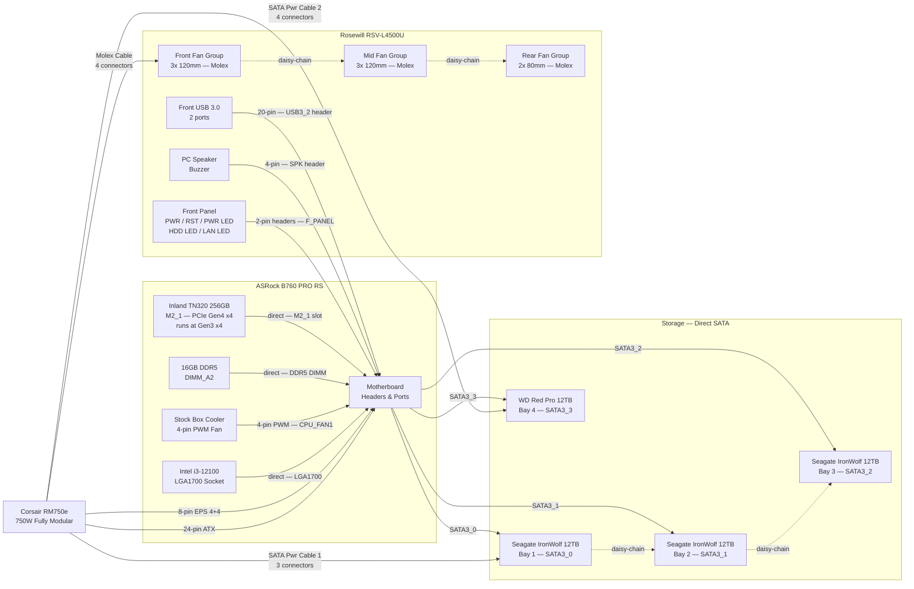

# Wiring Diagrams

Internal cabling reference for each node. Covers power, data, and front-panel connections. Solid arrows are direct cable runs; dashed arrows are daisy-chained connectors on the same cable.

---

## NAS Node

**Motherboard:** ASRock B760 PRO RS
**PSU:** Corsair RM750e 750W (fully modular)
**Chassis:** Rosewill RSV-L4500U (non-hot-swap — direct SATA to each drive)

### Diagram

---

### Connection Reference

#### Power

| Cable | From | To | Connectors Used |
| :--- | :--- | :--- | :--- |
| 24-pin ATX | PSU | MB — 24-pin ATX | 1 of 1 |
| 8-pin EPS (4+4) | PSU | MB — CPU_PWR1 | 1 of 2 included |
| SATA Power Cable 1 (3-conn) | PSU | HDD1 → HDD2 → HDD3 (daisy-chain) | 3 of 3 |
| SATA Power Cable 2 (4-conn) | PSU | HDD4 | 1 of 4 |
| Molex Cable (4-conn) | PSU | Front fans → Mid fans → Rear fans (daisy-chain) | 3 of 4 |

> **Unused PSU cables (leave unplugged):** 2nd EPS 8-pin, 12VHPWR (16-pin), both PCIe 6+2 cables.

#### SATA Data

| Cable | Motherboard Port | Drive |
| :--- | :--- | :--- |
| SATA data #1 | SATA3_0 | Seagate IronWolf 12TB — Bay 1 |
| SATA data #2 | SATA3_1 | Seagate IronWolf 12TB — Bay 2 |
| SATA data #3 | SATA3_2 | Seagate IronWolf 12TB — Bay 3 |
| SATA data #4 | SATA3_3 | WD Red Pro 12TB — Bay 4 |

> No SATA ports are disabled by the M.2 boot drive. All 4 SATA3 ports remain fully available regardless of M2_1 occupancy on the B760 PRO RS.

#### Direct / No-Cable Connections

| Component | Connection |
| :--- | :--- |
| Intel i3-12100 | Seats directly into LGA1700 socket |
| Stock box cooler fan | 4-pin PWM cable → CPU_FAN1 header |
| 16GB DDR5 | Seats directly into **DIMM_A2** (second slot from CPU — correct slot for single-stick) |
| Inland TN320 NVMe | Seats directly into **M2_1** (top slot, CPU-direct, includes heatsink) |

#### Front Panel

| Signal | Header on MB | Notes |
| :--- | :--- | :--- |
| Power button | F_PANEL — PWRBTN | 2-pin |
| Reset button | F_PANEL — RESET | 2-pin |
| Power LED | F_PANEL — PWRLED | 2-pin, polarity matters |
| HDD activity LED | F_PANEL — HDLED | 2-pin, polarity matters |
| LAN activity LED | — | Not supported by most consumer motherboard front-panel headers; leave disconnected |
| PC Speaker / Buzzer | SPK header | 4-pin |
| Front USB 3.0 (2 ports) | USB3_2 header | 20-pin connector |

---

### Notes

- **Fan power:** All 8 case fans use 4-pin Molex connectors and are grouped by location (front / mid / rear). Each group daisy-chains its fans together sharing one Molex connector off the cable. Only 3 of the 4 available Molex connectors on the RM750e's Molex cable are needed — no splitter required.
- **Single EPS cable:** The i3-12100 requires only one 8-pin EPS connection (CPU_PWR1). The second EPS cable included with the RM750e is not needed.
- **SATA power headroom:** SATA Power Cable 2 has 3 spare connectors — available for additional drives or a SATA-powered device in future.
- **Airflow direction:** Front and mid fans draw air in; rear fans exhaust. Ensure CPU cooler orientation aligns with this front-to-back flow.
- **Cable management:** The RSV-L4500U is a 4U chassis with significant internal depth. Route SATA data cables along the bottom channel to keep them clear of the fan path between the HDD bays and the rear fans.
